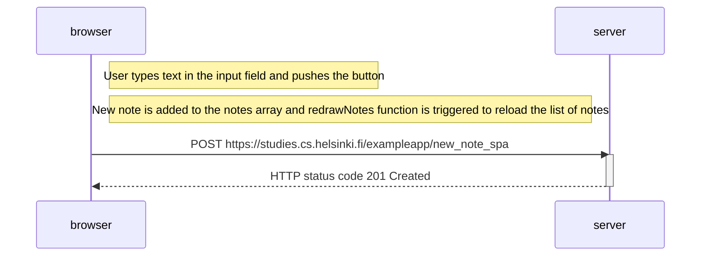

```mermaid
sequenceDiagram
    participant browser
    participant server

    Note right of browser: User types text in the input field and pushes the button
    Note right of browser: New note is added to the notes array and redrawNotes function is triggered to reload the list of notes
    browser->>server: POST https://studies.cs.helsinki.fi/exampleapp/new_note_spa
    activate server
    server-->>browser: HTTP status code 201 Created
    deactivate server

```